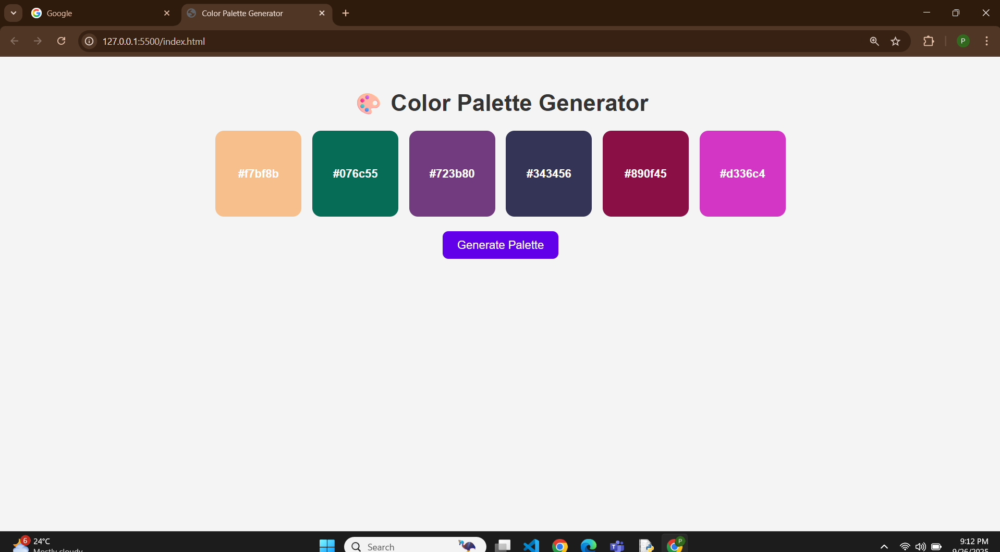

 🎨 Color Palette Generator

The Color Palette Generator is a simple, visually appealing web app built with HTML, CSS, and JavaScript.  
It allows users to generate a set of random color palettes instantly and copy any color code with a single click.  
Perfect for designers, developers, or anyone seeking quick color inspiration.  

---

 ✨ Features
- 🔄 Generate 6 random colors with one click  
- 📋 Click a color box to copy its HEX code 
- 🎨 Attractive hover animations and responsive design  
- 🚀 Works directly in the browser (no backend required)  

---
 📸 Preview

 🖼️ Screenshot

## 🛠 Tech Stack
- HTML5 – Structure  
- CSS3 – Styling & animations  
- JavaScript  – Logic for generating and copying colors  

---

